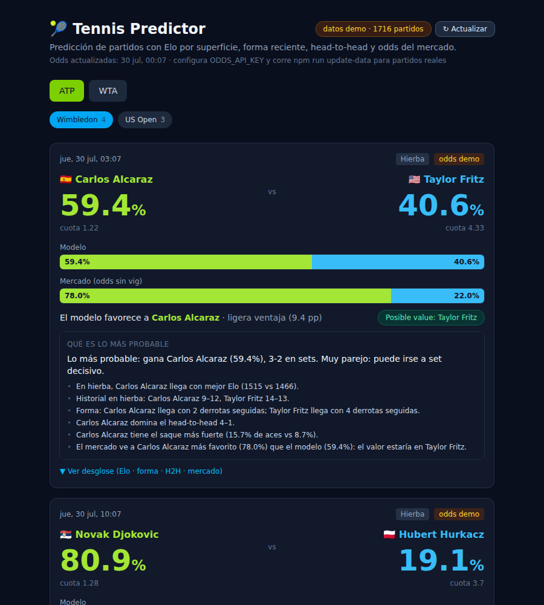

# 🎾 Tennis Predictor

Aplicación web + API REST para **predecir resultados de partidos de tenis** (ATP y WTA,
singles) combinando historial partido a partido, **ratings Elo por superficie**, forma
reciente, head-to-head y **odds de casas de apuestas**.

El modelo es **explicable, no una caja negra**: cada señal se expresa en puntos Elo y se
muestra lado a lado con la probabilidad implícita del mercado, incluyendo la detección de
posible *value* cuando el modelo discrepa de las cuotas.

> ⚠️ **Aviso**: es una estimación estadística, **no** una certeza ni una recomendación para
> apostar. No considera lesiones de último momento, clima ni motivación (p. ej. exhibiciones).



---

## Qué incluye

- **ATP y WTA**, singles. Torneos configurables (4 Grand Slams + Masters 1000 / WTA 1000 de
  fábrica) en `config/tournaments.json` — se amplía agregando entradas, sin tocar la lógica.
- **Elo general + por superficie** (dura / arcilla / hierba) con K-factor dinámico y ponderado por
  el margen de victoria.
- **Forma reciente**, **head-to-head** y **comparación contra el mercado** (probabilidad
  implícita sin vig + detección de value).
- **Probabilidad de victoria en grande** para cada jugador (con un decimal), y todas las cifras
  consistentes entre sí: los dos lados siempre suman exactamente 100.0%.
- **Datos de cada jugador en el partido**: ranking oficial ATP/WTA + puntos, país, edad y mano.
  Se muestran aunque el modelo no pueda predecir (jugador sin partidos en el historial), y en ese
  caso también se muestra la probabilidad implícita del mercado.
- **Modelo calibrado y verificado:** `npm run backtest` mide la exactitud real — **65.2% de
  acierto** y probabilidades calibradas dentro de ~1 pp, sobre **22.062 partidos ATP
  out-of-sample** (2015–2026). Incluye baseline de ranking y análisis de las discrepancias con el
  mercado. Ver [docs/MODEL.md](docs/MODEL.md).
- **Elo que aprovecha el marcador:** la K se escala con el **margen de games** (un 6-0 6-0 no
  informa lo mismo que un 7-6 6-7 7-6), penaliza la **inactividad** (volver de un parón largo hace
  rendir peor de lo que dice el Elo — medido, no supuesto) y **calibra distinto al mejor de 3 que al
  mejor de 5**. Cada cambio se aceptó solo tras verificar con el backtest que baja el Brier.
- **Track record propio:** la app **anota cada predicción antes** de que se juegue el partido y la
  puntúa cuando llega el resultado real, así que el dashboard muestra su acierto **en los partidos
  que tú viste** — no solo en el backtest histórico. Incluye comparación contra el mercado en esos
  mismos partidos. Ver [«Aciertos reales»](#aciertos-reales-de-la-app).
- **Fiabilidad por predicción:** cada probabilidad viene con un semáforo (alta / media / baja) y un
  **rango** (p. ej. *62% ± 3 pp*), calculado con cuántos partidos respaldan cada Elo, cuántos en esa
  superficie y si los datos del jugador están viejos. Un 62% con 800 partidos detrás y un 62% con 8
  ya no se ven iguales.
- **Resumen "qué es lo más probable"** en cada partido: en lenguaje natural, con el favorito,
  su probabilidad, el marcador probable y las razones (superficie, forma, H2H, saque, mercado).
- **Probabilidad de cada marcador** (2-0, 3-1, …) derivada matemáticamente de la probabilidad del
  partido, más probabilidad de set decisivo y de ganar sin ceder sets.
- **Señales físicas** por jugador: retiros, walkovers, días sin competir y carga de partidos
  (evidencia extraída de los resultados — no un diagnóstico médico ni una fuente de lesiones).
- **Historial en el torneo**: récord, títulos y mejor ronda de cada jugador en ese evento.
- **Desglose completo por partido**: explicación de *por qué* gana X (qué señal pesa más),
  ranking por Elo, últimos 5 resultados, récord en la superficie, comparativa de saque/quiebre
  (ace%, 1er saque, break points salvados) y marcador estimado.
- **Partidos próximos reales + auto-actualización:** con una API key, la app descubre los
  torneos de tenis activos ahora, trae sus partidos y refresca las odds sola cada pocas horas
  (o al pulsar *Actualizar*).
- **Dashboard** para elegir circuito y torneo, ver próximos partidos con barras
  modelo-vs-mercado, perfil de jugador (Elo por superficie + saque/quiebre + últimos
  resultados) y H2H.
- Datos guardados localmente en **SQLite** (`data/tennis.db`) para no depender de llamadas
  repetidas a las APIs.

## Fuentes de datos

| Tipo | Fuente | Por qué |
|------|--------|---------|
| Histórico ATP | [Tennismylife `TML-Database`](https://github.com/Tennismylife/TML-Database) | Gratis, sin API key, partido a partido desde 1968 hasta la temporada actual, con superficie, ronda, sets, estadísticas de saque/quiebre **y el ranking oficial de cada jugador en cada partido**. Mismo formato de columnas que el dataset clásico de Jeff Sackmann. |
| Histórico WTA | *(pendiente)* | Los repos `JeffSackmann/tennis_atp` y `tennis_wta` dejaron de estar accesibles públicamente (404). TML cubre ATP; para WTA no hay todavía un equivalente abierto y accesible, así que la app avisa y sigue funcionando con ATP. |
| Datos de jugador | Incluidos en el histórico | Ranking oficial + puntos, país y mano. (El ATP Tour no ofrece API pública, y hacer scraping de su web sería frágil y de legalidad dudosa.) |
| Odds | [The Odds API](https://the-odds-api.com) | Cuotas head-to-head de partidos próximos ATP/WTA. Plan gratuito (500 req/mes). Requiere API key. |

---

## Requisitos

- **Node.js ≥ 22.5** (usa el módulo integrado `node:sqlite`, sin dependencias nativas).

## Instalación

```bash
git clone <este-repo>
cd <repo>
npm install
cp .env.example .env    # opcional: para odds reales, ver abajo
```

## Puesta en marcha rápida (con datos de demostración, sin internet)

```bash
npm run seed     # carga un dataset de muestra en data/tennis.db
npm run dev      # levanta API (:4000) + frontend (:5173)
```

Abre **http://localhost:5173**. Elige ATP/WTA y un torneo (Wimbledon, US Open…), verás los
próximos partidos con la predicción del modelo y las odds lado a lado.

> El seed usa **datos sintéticos** (nombres reales, partidos simulados) para que la app
> funcione end-to-end sin conexión. El badge "datos demo" lo indica. Reemplázalo con datos
> reales usando `npm run update-data`.

---

## Odds reales y partidos próximos (The Odds API)

Los partidos próximos **reales** (los que se juegan hoy/esta semana) y sus cuotas vienen de
The Odds API. Sin key, la app muestra un demo con partidos de ejemplo.

1. Regístrate gratis en **https://the-odds-api.com** y copia tu API key (botón *Get API Key*).
   El plan gratuito da 500 requests/mes.
2. En tu archivo `.env`:

   ```bash
   ODDS_API_KEY=tu_clave_aqui
   ODDS_REGIONS=eu,uk
   ```

   (NUNCA subas tu `.env` — está en `.gitignore`.)
3. Ejecuta `npm run update-data`. La ingesta **descubre automáticamente los torneos de tenis
   activos** en ese momento (Grand Slams, Masters/1000, 500…) y trae sus partidos, así aparece
   lo que realmente se juega hoy — no una lista fija.

### Que se actualice solo

Con la key configurada, el servidor **refresca las odds automáticamente** mientras corre
(al arrancar y cada `AUTO_REFRESH_MINUTES`, 6 h por defecto). También puedes pulsar
**↻ Actualizar** en el dashboard para refrescar al instante. La cabecera muestra la hora de la
última actualización.

## Actualizar datos (histórico + odds)

```bash
npm run update-data
# opciones:
npm run update-data -- --from 2015 --to 2025    # rango de temporadas
npm run update-data -- --tour atp               # solo un circuito
npm run update-data -- --skip-odds              # solo histórico
```

Esto:
1. Descarga los CSV del histórico para el rango de años (cacheados en `data/raw/`).
2. Recalcula todos los ratings Elo.
3. Descarga odds en vivo de The Odds API (o genera fixtures si no hay key / fuera de temporada).

> `update-data` necesita acceso a internet (GitHub + The Odds API). En entornos sin red usa
> `npm run seed`.

### Método manual (si la descarga automática falla)

Funciona siempre, sin git y sin credenciales. Útil si tu red filtra GitHub o si `git` tiene
credenciales guardadas que GitHub rechaza:

1. Abre https://github.com/Tennismylife/TML-Database → botón verde **Code** → **Download ZIP**.
2. Mueve el ZIP **sin renombrar ni descomprimir** a la carpeta `data/raw/` del proyecto.
3. Ejecuta `npm run update-data`. La app detecta el ZIP, lo descomprime sola y lo usa.

`npm run update-data -- --fresh` limpia la caché de descargas pero **conserva** los ZIP que hayas
puesto a mano, así que puedes reintentar sin volver a descargarlos.

---

## Aciertos reales de la app

El `npm run backtest` mide el modelo sobre 20 años de historial. Útil para ajustarlo, pero no
responde la pregunta que de verdad importa: **¿ha acertado los partidos que yo miré?**

Para eso la app lleva su propio registro:

1. Cada vez que muestra una predicción de un partido **real** próximo, la **guarda** (probabilidad,
   favorito, cuotas del momento, fiabilidad declarada).
2. Ese registro **no se reescribe nunca**: la primera cifra servida es la que se puntúa, así que no
   puede «mejorar» sola cuando se mueven las cuotas.
3. Cuando el resultado real entra al historial (al correr `npm run update-data`), la predicción se
   empareja con él y se puntúa.

El dashboard lo muestra arriba, plegable: acierto, Brier, log loss, calibración (dicho vs ocurrido),
**el mismo cálculo para el mercado en esos mismos partidos**, y el desglose por fiabilidad
declarada. Con menos de 30 partidos resueltos avisa de que la muestra es pequeña.

> El registro **sobrevive** a `npm run update-data`: reingerir el historial no borra tu track record.
> Los partidos de demostración (`odds demo`) **no** se registran: nunca se juegan, así que puntuar
> contra ellos no significaría nada.

Sirve además como detector de averías: si los datos se rompen o quedan viejos, el acierto cae y lo
ves, en vez de fallar en silencio.

## Scripts

| Comando | Qué hace |
|---------|----------|
| `npm run dev` | Levanta backend + frontend a la vez |
| `npm run seed` | Carga el dataset de demostración |
| `npm run update-data` | Refresca histórico real + odds |
| `npm run backtest` | Mide la exactitud del modelo (accuracy, Brier, calibración, fiabilidad) |
| `npm run build` | Build de producción del frontend + typecheck del backend |
| `npm run typecheck` | Chequeo de tipos de ambos workspaces |

### Medir cambios del modelo

El backtest acepta banderas para **desactivar o reajustar** cada pieza y ver qué aporta, sobre los
mismos partidos:

```bash
npm run backtest -- --tour atp --from 2015   # ventana de evaluación
npm run backtest -- --mov 0                  # sin margen de victoria
npm run backtest -- --rest 0                 # sin penalización por inactividad
npm run backtest -- --bo3 0.7 --bo5 0.9      # otra calibración por formato
npm run backtest -- --calibration 1          # curva Elo cruda, un solo factor
```

Así ninguna decisión del modelo depende de una intuición: se compara y se queda la que mide mejor.

## API REST (puerto 4000)

| Endpoint | Descripción |
|----------|-------------|
| `GET /api/meta` | Fuente de datos y conteos |
| `GET /api/track-record?tour=` | Acierto medido de la app en partidos ya jugados (+ mercado) |
| `GET /api/tours` | Circuitos ATP/WTA con conteos |
| `GET /api/tours/:tour/players?q=` | Jugadores (búsqueda) |
| `GET /api/players/:tour/:id` | Perfil: Elo general + por superficie + últimos resultados |
| `GET /api/tournaments?tour=` | Torneos configurados y cuáles tienen partidos próximos |
| `GET /api/matches/upcoming?tour=&tournament=` | Próximos partidos con odds y predicción |
| `GET /api/h2h?tour=&p1=&p2=` | Head-to-head entre dos jugadores |
| `GET /api/predictions/:id` | Predicción completa de un partido próximo |
| `GET /api/predictions?tournament=` | Predicciones de todos los próximos de un torneo |
| `POST /api/predict` | Predicción ad-hoc `{tour, p1, p2, surface, odds1?, odds2?}` |

## Estructura del proyecto

```
config/        tours.json + tournaments.json  (ampliar aquí, no en el código)
data/          SQLite + CSV crudos + dataset seed
docs/          MODEL.md — cómo funciona el modelo
server/        API REST (Fastify) + ingesta + modelo Elo   (TypeScript)
web/           Dashboard (React + Vite + Tailwind)          (TypeScript)
```

## Cómo funciona el modelo

Ver **[docs/MODEL.md](docs/MODEL.md)** para la explicación completa del cálculo del Elo, cómo
se combinan las señales y las limitaciones. La lógica también está comentada en el código
(`server/src/model/`).
