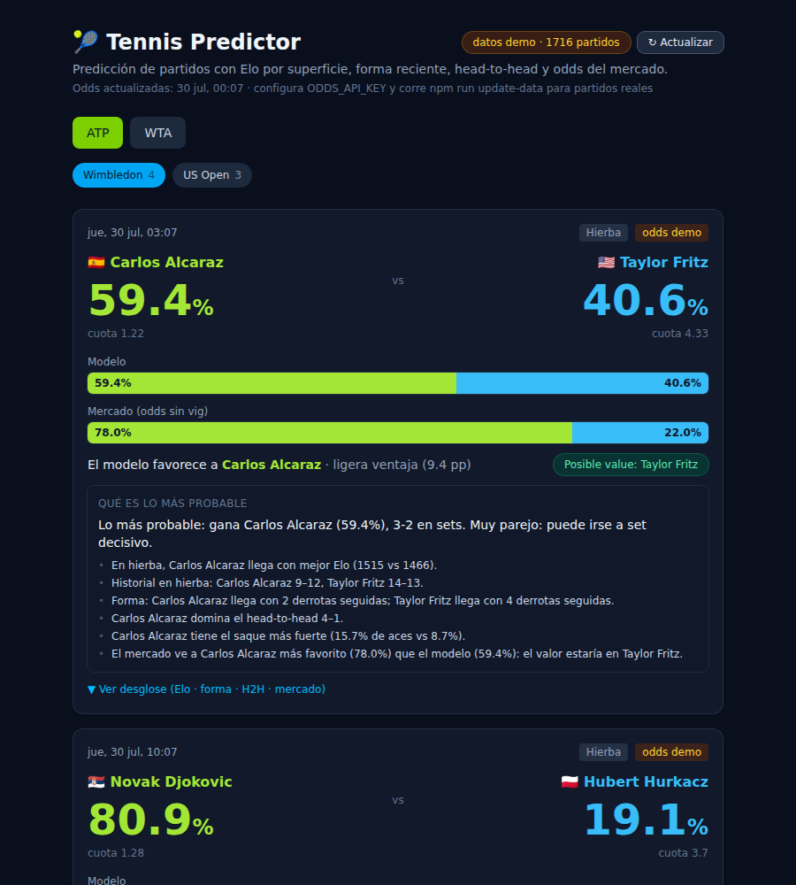

# ⚽⚾🏈🏒🏀🎾 Sports Predictor

Aplicación web + API REST para **predecir resultados deportivos** combinando historial
partido a partido, **ratings Elo**, forma reciente y **odds de casas de apuestas**.

Seis deportes en **pestañas separadas** (nunca mezclados), más una pestaña para tus propias apuestas:

- **⚽ Fútbol** — las principales ligas del mundo, cada una en su **sub-pestaña**: Premier League,
  LaLiga, Bundesliga, Serie A, Ligue 1, Eredivisie, Primeira, Championship, MLS, Liga MX,
  Brasileirão, Argentina y Champions. **1X2** (con el empate como opción de primera), goles
  esperados, over/under 2.5, ambos marcan y marcadores probables.
  Ver [docs/FOOTBALL.md](docs/FOOTBALL.md).
- **⚾ Béisbol** — MLB (y NPB, KBO y universitario con probabilidades de mercado). El deporte donde
  **un solo jugador anunciado el día antes**, el lanzador abridor, mueve más el pronóstico que nada
  salvo los propios equipos — y puedes cambiarlo tú. Ahora también **el estadio**: Coors Field sube
  el total un 22 %, Seattle lo baja un 8 %. Ganador, total, línea de carreras (±1.5) y rejilla de
  marcadores, todo de la misma distribución.
  Ver [docs/BASEBALL.md](docs/BASEBALL.md).
- **🏈 Fútbol americano** — NFL: hándicap, total y ganador con una distribución de margen que
  **conoce los números clave del deporte** (el margen acaba en 3 el 15 % de las veces y en 9 el
  1.6 %) y que sabe **quién juega de quarterback**. Es el único deporte de la app cuyo modelo
  **se puede medir contra la línea de cierre real** — y el backtest dice, sin adornos, que no la
  bate, aunque ahora se queda más cerca.
  Ver [docs/NFL.md](docs/NFL.md).
- **🏒 NHL** — Elo por equipo con la diferencia de goles y una Poisson ligada a ese Elo: ganador
  con prórroga y tanda, el partido a 60 minutos y el total de goles, de la misma distribución.
  Publicada al ganar a «siempre el local» y a un Elo básico en 20.214 partidos fuera de muestra;
  sin cuotas históricas, no se sabe si le gana al mercado, y lo dice.
  Ver [docs/NHL.md](docs/NHL.md).
- **🥊 UFC** — Elo por luchador, récord, edad, alcance y peleas en la UFC en una regresión logística
  que dice cuánto aporta cada cosa. Publicada al ganar a sus cuatro referencias (también a «el de
  mejor récord») en 7.799 peleas fuera de muestra y en 2025 por separado; sin cuotas históricas, no
  se sabe si le gana al mercado. Sin clave no hay cartelera: las peleas que vienen llegan con las
  cuotas. Ver [docs/UFC.md](docs/UFC.md).
- **🏀 Baloncesto** — NBA, WNBA, NCAA (M y F), EuroLeague y NBL: Elo por equipo con ventaja de
  campo, margen de puntos y descanso, más **diferencia esperada (spread)** y **total de puntos**.
  Ver [docs/BASKETBALL.md](docs/BASKETBALL.md).
- **🎾 Tenis** — ATP y WTA singles: Elo por superficie, forma, head-to-head, marcador por sets.
  Ver [docs/MODEL.md](docs/MODEL.md).
- **🎟️ Apuestas** — *no es un deporte*: es tu registro. Qué apostaste, cuánto, a qué cuota y cómo
  acabó, con beneficio, ROI, calendario del mes y rachas. Y lo que ningún historial de casa de
  apuestas te dice: **si seguir al modelo te sirvió o no**.

El modelo es **explicable, no una caja negra**: cada señal se expresa en puntos Elo y se
muestra lado a lado con la probabilidad implícita del mercado, incluyendo la detección de
posible *value* cuando el modelo discrepa de las cuotas.

Cada pestaña abre con **«donde el modelo no está de acuerdo con el mercado»**: los mercados
concretos —1X2, doble oportunidad, over/under, ambos marcan, hándicap, línea de carreras— en los
que el modelo se separa más de la cuota, con la probabilidad de cada uno y **la cuota mínima que
necesitarías** para que la apuesta valga la pena según el modelo. Ver
[«Sugerencias por deporte»](docs/ARQUITECTURA.md#sugerencias-por-deporte-lo-que-el-modelo-destacaría).

> ⚠️ **Aviso**: es una estimación estadística, **no** una certeza ni una recomendación para
> apostar. No considera lesiones de último momento, clima ni motivación (p. ej. exhibiciones).



---

## Empezar

Node ≥ 22.13 (usa `node:sqlite`, sin dependencias nativas).

```bash
git clone <este-repo> && cd <repo>
npm install
npm run setup        # asistente: .env, migraciones, datos (descarga, construcción o demostración), doctor
npm run dev          # API (:7374) + web (:7373) → http://localhost:7373
```

La clave de cuotas se pone con `npm run clave`: la pide sin enseñarla, deja una sola línea
`ODDS_API_KEY=` en el `.env` de la raíz y la comprueba sin gastar créditos (y avisa si la terminal
tiene otra que le gana). O a mano: `cp .env.example .env` (y la clave en `ODDS_API_KEY=`), `npm run fetch-data`
(historia publicada, 9 MB) o `npm run update-all -- --skip-odds` (construirla), y `npm run dev`.
Sin clave la app arranca en demostración, etiquetada como tal. `npm run go` hace todo lo anterior
de una vez.

## Diez comandos

| Comando | Qué hace |
|---|---|
| `npm run help` | Todos los comandos, por grupo, con una línea cada uno |
| `npm run dev` | Backend y frontend a la vez |
| `npm run doctor` | Diagnóstico de punta a punta sin gastar cuota (`-- --probar` gasta 1 crédito por deporte) |
| `npm run update-all` | Los siete deportes de una tirada (`-- --skip-odds` no gasta cuota) |
| `npm run update-results` | Resultados de fútbol, baloncesto, béisbol, NFL, NHL y UFC, sin cuota (el servidor lo hace cada 6 h) |
| `npm run odds` | Refresca las cuotas reales ahora |
| `npm run paper` | El banco de papel: liquida, evalúa y apuesta lo que apruebe la política |
| `npm run backup` / `npm run restore` | Copia y restauración del libro mayor (`ledger.db`) |
| `npm run verify:data` | 500+ comprobaciones de la base; falla si algo no cuadra |
| `npm run export -- papel` | Exporta predicciones, apuestas, papel, snapshots o benchmark (CSV/JSON) |

## Documentación

| Tema | Dónde |
|---|---|
| Arquitectura y diseño, árbol del repo | [docs/ARQUITECTURA.md](docs/ARQUITECTURA.md) |
| Fuentes de datos y actualización | [docs/FUENTES.md](docs/FUENTES.md) |
| Modelos por deporte | [FOOTBALL](docs/FOOTBALL.md) · [BASEBALL](docs/BASEBALL.md) · [NFL](docs/NFL.md) · [BASKETBALL](docs/BASKETBALL.md) · [MODEL (tenis)](docs/MODEL.md) |
| Cuotas y mercado | [docs/CUOTAS.md](docs/CUOTAS.md) |
| Dinero y riesgo: banco de papel, señales, política versionada, topes | [docs/DINERO_Y_RIESGO.md](docs/DINERO_Y_RIESGO.md) |
| La capa de confianza: abstención, incertidumbre, auditoría | [docs/CONFIANZA.md](docs/CONFIANZA.md) |
| Operación: doctor, despliegue, trabajos, métricas, exportaciones | [docs/OPERACION.md](docs/OPERACION.md) |
| Notificaciones | [docs/NOTIFICACIONES.md](docs/NOTIFICACIONES.md) |
| La interfaz: rutas, navegación, tema, idiomas, accesibilidad | [docs/INTERFAZ.md](docs/INTERFAZ.md) |
| Funciones de producto: laboratorio de estrategias, bandeja, informes, líneas, archivo | [docs/PRODUCTO.md](docs/PRODUCTO.md) |
| Rendimiento: medidas, caché, compresión y presupuestos de CI | [docs/RENDIMIENTO.md](docs/RENDIMIENTO.md) |
| Cómo contribuir: fases, experimentos, no inventar datos, validaciones | [CONTRIBUTING.md](CONTRIBUTING.md) |
| API (y `/docs` en el servidor) | [docs/API.md](docs/API.md) |
| Experimentos, métricas y estudios | [docs/EXPERIMENTOS.md](docs/EXPERIMENTOS.md) |
| Base de datos y copias | [docs/BASE_DE_DATOS.md](docs/BASE_DE_DATOS.md) |
| Seguridad | [docs/SEGURIDAD.md](docs/SEGURIDAD.md) |
| Hoja de ruta y qué cambió en cada fase | [docs/plans/](docs/plans/) · [CHANGELOG.md](CHANGELOG.md) |

## Base de datos y copias

Dos ficheros: `history.db` (historia, se vuelve a bajar) y `ledger.db` (el libro mayor: lo que
no se puede volver a conseguir). El `tennis.db` antiguo se parte solo al arrancar. Migraciones
numeradas que paran el servidor si una falla, copia del libro mayor programada (`BACKUP_HOURS`,
local y opcionalmente S3), restauración, retención manual de snapshots con exportación previa,
`ingestion_runs` con cada trabajo de datos y resultados programados cada 6 h
(`RESULTS_REFRESH_HOURS`). Todo en **[docs/BASE_DE_DATOS.md](docs/BASE_DE_DATOS.md)**.

## Seguridad

Contraseña con sesiones por cookie (y segundo factor TOTP opcional), límite de intentos,
cabeceras de seguridad, CORS cerrado, registro de errores y un escáner de secretos en el hook de
pre-commit, en CI y en el doctor. Todo en **[docs/SEGURIDAD.md](docs/SEGURIDAD.md)**.

**La clave de The Odds API la tiene que rotar el propietario.** Estuvo en un chat y un valor con
su forma apareció en un comentario del código (ya retirado, pero sigue en el historial de git).
Genera una nueva en tu cuenta y pon solo la nueva en el `.env`. Ver `docs/SEGURIDAD.md`.
