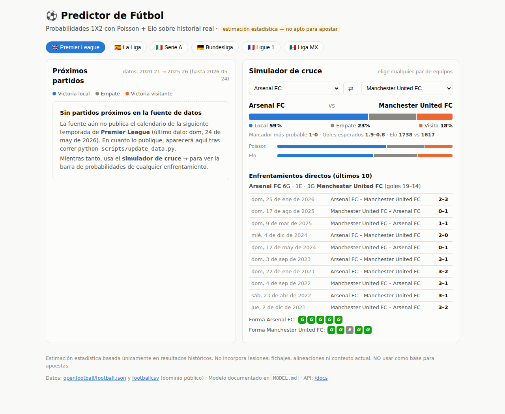

# ⚽ Predictor de Fútbol

Aplicación web + API REST que estima probabilidades de resultado
(victoria local / empate / victoria visitante) para las 5 grandes ligas
europeas y la Liga MX, usando un modelo estadístico **explicable**
(Poisson de goles esperados + rating Elo) entrenado con historial real
partido a partido.

> ⚠️ **Esto es una estimación estadística, no una certeza.** El modelo solo ve
> resultados históricos (no lesiones, fichajes ni alineaciones) y acierta
> ≈52% de los resultados 1X2 en backtest — mejor que el azar, muy lejos de la
> bola de cristal. **No lo uses para apostar.** Detalles y números honestos en
> [MODEL.md](MODEL.md).



## Ligas incluidas

Premier League 🇬🇧 · La Liga 🇪🇸 · Serie A 🇮🇹 · Bundesliga 🇩🇪 · Ligue 1 🇫🇷 · Liga MX 🇲🇽
— unas 6 temporadas de historial por liga (~12,800 partidos). La lista vive en
`config/leagues.json`: [añadir una liga](#añadir-una-liga) no requiere tocar código.

## Datos: fuentes abiertas, sin API keys

Los datos vienen de dos datasets públicos alojados en GitHub (dominio público,
sin registro, sin límites de peticiones):

- [openfootball/football.json](https://github.com/openfootball/football.json) — JSON por temporada
- [footballcsv](https://github.com/footballcsv) — CSV por temporada (caché de worldfootball)

**No se necesita ninguna API key.** Los archivos crudos se guardan en `data/raw/`
y la base consolidada en `data/football.db` (SQLite), así que tras la primera
descarga casi todo funciona sin red. Para conectar otra fuente (p. ej.
football-data.co.uk o una API comercial) se escribe un adapter en
`backend/sources.py` y se referencia desde el config — el resto no cambia.

## Instalación y arranque

Requisitos: Python 3.11+.

```bash
cd football-predictor
python3 -m venv .venv && source .venv/bin/activate   # opcional pero recomendado
pip install -r requirements.txt

# 1) Descargar/actualizar los datos históricos (≈35 archivos, 1-2 min)
python scripts/update_data.py

# 2) Levantar la app (API + dashboard)
uvicorn backend.main:app --reload
```

Abre **http://localhost:8000** → eliges liga, ves los próximos partidos con su
barra de probabilidades y puedes simular cualquier cruce con su head-to-head.
La documentación interactiva de la API queda en **http://localhost:8000/docs**.

### Actualizar los datos cuando quieras

```bash
python scripts/update_data.py              # refresca temporadas vivas (usa caché para las cerradas)
python scripts/update_data.py --force      # re-descarga todo
python scripts/update_data.py --league liga-mx
python scripts/update_data.py --check-names  # detecta renombres de equipos en la fuente
```

Correrlo una vez por semana durante la temporada es suficiente. Los modelos se
reajustan solos en el siguiente request (detectan el cambio de la base).

**Nota de temporada** (julio 2026): las ligas europeas están en receso y las
fuentes aún no publican los calendarios 2026-27, así que "Próximos partidos"
puede aparecer vacío; el calendario aparecerá solo al correr `update_data`
cuando la fuente lo publique (las temporadas futuras ya están declaradas en el
config). El simulador de cruces funciona siempre.

## API

| método y ruta | qué devuelve |
|---|---|
| `GET /api/leagues` | ligas disponibles con rango de temporadas y frescura |
| `GET /api/leagues/{id}/teams` | equipos vigentes (`?all=true` para históricos) |
| `GET /api/leagues/{id}/fixtures` | próximos partidos publicados por la fuente |
| `GET /api/leagues/{id}/predictions` | predicción para cada próximo partido |
| `GET /api/predict?league=&home=&away=` | predicción de cualquier cruce + head-to-head + forma |
| `GET /api/h2h?league=&home=&away=` | solo el head-to-head |
| `GET /api/meta` | estado de datos, parámetros del modelo y disclaimer |

Ejemplo:

```bash
curl "http://localhost:8000/api/predict?league=liga-mx&home=CF%20América&away=Deportivo%20Guadalajara"
```

```json
{
  "prediction": {
    "probs": {"home": 0.6025, "draw": 0.2437, "away": 0.1538},
    "most_likely_score": "1-0",
    "expected_goals": {"home": 1.49, "away": 0.64, "total": 2.13},
    ...
  },
  "h2h": {"summary": {"wins_a": 6, "draws": 3, "wins_b": 1, ...}, "matches": [...]},
  "form": {"home": [...], "away": [...]}
}
```

Si escribes mal un equipo, el error 404 sugiere los nombres más parecidos.

## Añadir una liga

1. Localiza la liga en las fuentes (p. ej. Eredivisie = código `nl.1` en
   football.json; consulta las carpetas de temporada de cada repo).
2. Añade una entrada en `config/leagues.json`:

```json
{
  "id": "eredivisie",
  "name": "Eredivisie",
  "country": "Países Bajos",
  "flag": "🇳🇱",
  "sources": [
    {"adapter": "football_json", "code": "nl.1",
     "seasons": ["2021-22", "2022-23", "2023-24", "2024-25", "2025-26", "2026-27"]}
  ],
  "aliases": {}
}
```

3. `python scripts/update_data.py --league eredivisie` y listo. Corre también
   `--check-names` por si la fuente renombró equipos entre temporadas (se
   corrige con el mapa `aliases`, como hicimos con la Ligue 1).

## Estructura del proyecto

```
football-predictor/
├── config/leagues.json      # ligas, fuentes, alias y parámetros del modelo
├── scripts/update_data.py   # descarga/refresco de datos → SQLite
├── scripts/backtest.py      # evaluación honesta del modelo (walk-forward)
├── backend/
│   ├── main.py              # FastAPI: API REST + sirve el frontend
│   ├── db.py                # SQLite: esquema y consultas
│   ├── sources.py           # adapters de fuentes de datos (extensible)
│   ├── ingest.py            # orquestación de la ingesta
│   └── model/
│       ├── poisson.py       # goles esperados (ataque/defensa + decaimiento)
│       ├── elo.py           # Elo por margen + Davidson calibrado
│       └── predictor.py     # mezcla y fachada
├── frontend/                # dashboard (HTML/CSS/JS vanilla, sin build)
├── tests/                   # pytest del modelo
├── data/                    # crudos + football.db (generado, gitignored)
└── MODEL.md                 # explicación matemática + backtest + limitaciones
```

## Tests y evaluación

```bash
python -m pytest tests/      # propiedades del modelo (9 tests)
python scripts/backtest.py   # métricas por liga sobre la última temporada (~4 min)
```
